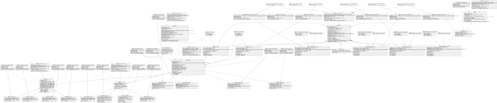

# OOP HW2-3 Fix

This repository attempts to modernize JJK's code.

## Breaking Changes

In order to improve on JJK's code, the following breaking changes have been made:

- All mutators and accessors have been renamed to use snake_case instead of camelCase.
- Since all `generator`s are inner classes of the classes they generate objects for, their names don't need to include their enclosing classes' names again, so they have all been renamed to `generator`.
- `GET` and `SET` has been modified to take one parameter only. The type of the property, the name of the accessor/mutator and the name of their parameters will be generated automatically. `GET_WITH_NAME` and `SET_WITH_NAME` were also added for customizing the generated accessor/mutator names.
- `event::generator` has been made to take a template parameter to avoid using `void *`s.
- `*::generator::print` functions have been moved to their enclosing classes of the inner classes they belong. For example, call `header::print` instead of `header::generator:print`. Except for `event::generator::print`, which have been moved to `event::print_registered_event_types`.
